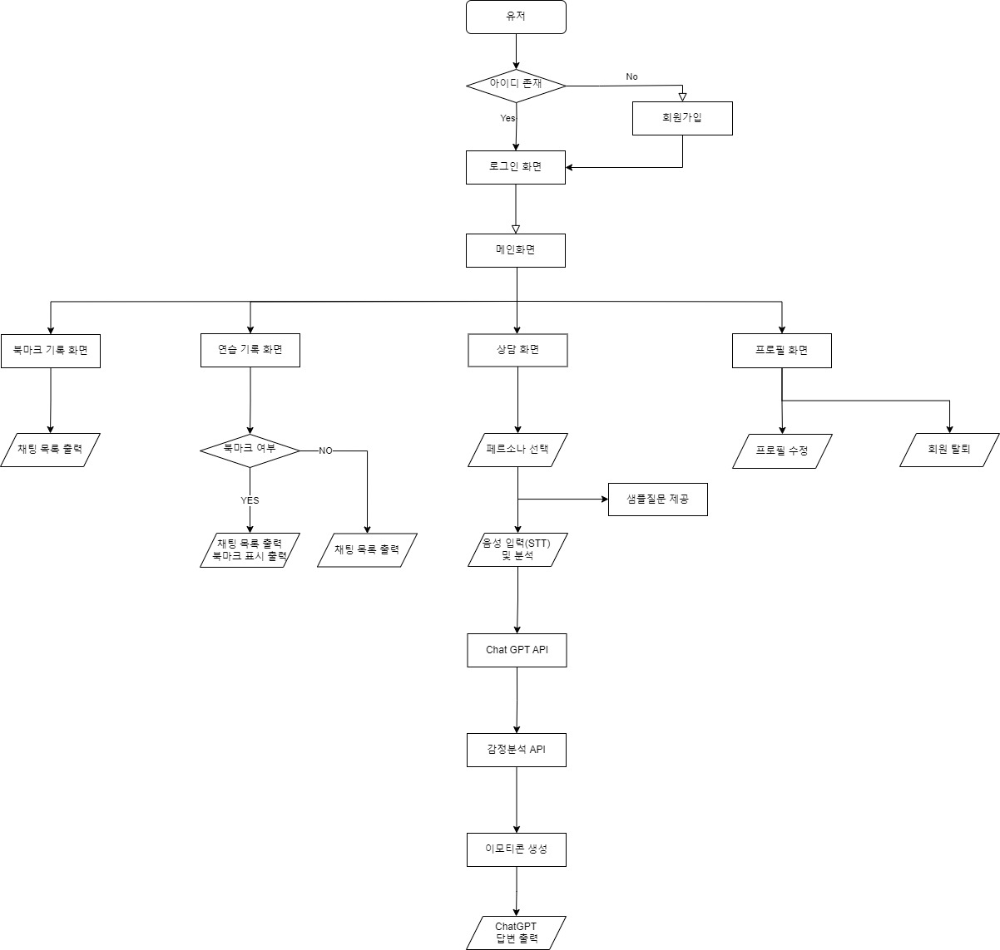

# AIVLE - Big Project 4반 16조

## 🖥️ 프로젝트 소개
ChatGPT 와 함께하는 리더 코칭 훈련
 

## 🕰️ 개발 기간
* 23.05.29일 - 23.07.11일

### 🧑‍🤝‍🧑 맴버구성
 - 팀장  : 서준호 - 백엔드, 히스토리 페이지
 - 팀원1 : 이경환 - 백엔드, 메인 페이지
 - 팀원2 : 장지수 - 백엔드, 로그인 페이지
 - 팀원3 : 박찬 - 백엔드, ChatGpt API
 - 팀원4 : 정호영 - 백엔드, ChatGpt API
 - 팀원5 : 최동현 - 프론트엔드
 - 팀원6 : 정명운 - 프론트엔드
 - 팀원7 : 임시완 - 프론트엔드

### ⚙️ 개발 환경
- **Language** : HTML, CSS, JavaScript, Python
- **Framework** : DJango
- **Database** : Oracle DB
- **Library** : React, emotion

## 👥 배경 및 목적
#### 선정배경
- 비용 및 시간 절감 필요
- 코칭 역량 강화 필요
- 코칭 대상 확보의 어려움  
  
#### 기대효과
- 여러가지 페르소나 설정을 통해 다양한 훈련케이스를 마련
- 전문가 초빙 비용 감소
- 리더 부재로 인한 팀 업무 비효율 방지

## 📌 주요 기능
#### 로그인
- DB값 검증
- ID찾기, PW찾기
#### 회원가입
- ID 중복 체크
- 회원탈퇴
#### 프로필 
- 회원정보 변경

#### 히스토리 페이지
- 전체 대화내역 불러오기
- 특정 대화내역 불러오기

#### 북마크 페이지
- 표시한 북마크 불러오기

#### 메인 페이지 
- Chat GPT API 연동
- 음성과 text로 Chat GPT와 상담 실습
- GROW 각 단계에 해당하는 표본질문 제시
- 보고서 기능

#### 관리자 페이지 
- 회원 관리

## 서비스 플로우
)

## 구동 방법
- 로그인 페이지에서 회원가입
- 로그인 완료후 메인화면으로 이동
- 상담하기 버튼을 통해 상담 화면으로 이동
- 페르소나 설정
- 음성입력 또는 타이핑으로 상담
- 상담완료 버튼으로 상담종료 및 보고서 생성
- 히스토리 페이지에서 이전 상담기록 확인 및 북마크 설정가능
- 북마크 페이지에서 북마크된 상담기록 확인
- 프로필 페이지에서 프로필 이미지, 이름, 이메일, 비밀번호 변경가능

